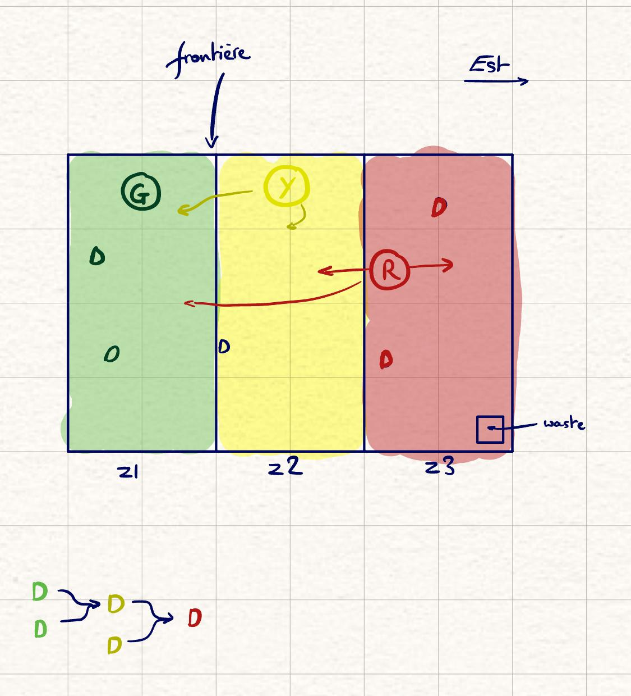
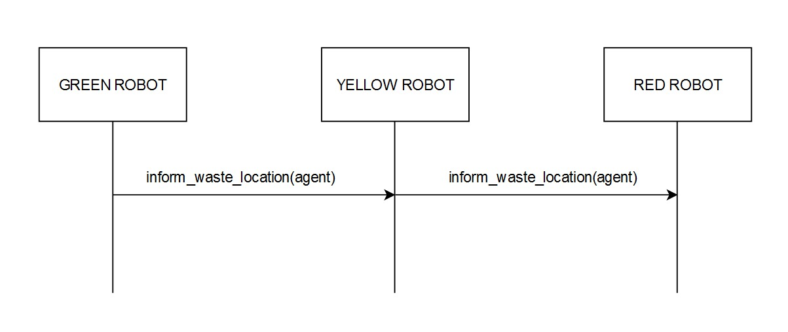

  # Project Overview

  This Multi-Agent System project involves the development of a robotic waste management system comprising three types of robots: Green, Yellow, and Red. Each robot has specific capabilities and limitations in handling different types of waste within designated zones. The project aims to efficiently collect and manage waste according to predefined rules while utilizing a communication protocol for waste management coordination.

  ## General Instructions

  1. _Green Robot:_

    - Tasked with picking up green waste initially.
    - Upon collecting two green wastes, it transforms them into one yellow waste.
    - Capable of transporting one yellow waste further east.
    - Restricted to zone z1.

  2. _Yellow Robot:_

    - Assigned to pick up yellow waste initially.
    - Transforms two yellow wastes into one red waste.
    - Can transport one red waste further east.
    - Allowed to move in zones z1 and z2.

  3. _Red Robot:_
    - Collects red waste initially.
    - Transports red waste further east to the waste disposal zone, where it is disposed of.
    - Can move in zones z1, z2, and z3.
    <p >
    

  </p>

  ## Specifications

  - _Agent:_

    - Operates with a vision of a 1-grid neighborhood.
    - If waste is within vision, the agent goes to collect it.
    - Otherwise, the agent engages in random movement.

  - _Deliberation:_

    - Takes information from the knowledge base.
    - Returns an action for the environment.
    - Actions include Movement (x,y) and HandleWaste (PickUp, DropOffandSendMessage, Transform, DropOff).
    - Note: Movement and HandleWaste cannot be executed simultaneously.

  - _Communication:_

    - Utilizes a communication protocol to inform robots when a transformed waste is dropped in the drop-off zone.
    - Each robot maintains a list in its knowledge base.
    - When a robot receives a message containing the location of a waste, it adds it to the list.
    - These locations aid the robot in waste finding mode, when not dropping off or transforming wastes.

      <p >
    

  </p>


```
├── README.md
└── robots
    ├── __init__.py
    ├── requirements.txt
    ├── robots
    │   ├── __init__.py
    │   ├── agents.py
    │   ├── communication
    │   │   ├── __init__.py
    │   │   ├── agent
    │   │   │   ├── CommunicatingAgent.py
    │   │   │   └── __init__.py
    │   │   ├── mailbox
    │   │   │   ├── Mailbox.py
    │   │   │   └── __init__.py
    │   │   ├── message
    │   │   │   ├── Message.py
    │   │   │   ├── MessagePerformative.py
    │   │   │   ├── MessageService.py
    │   │   │   └── __init__.py
    │   │   └── requirements.txt
    │   ├── model.py
    │   ├── percepts.py
    │   ├── resources
    │   ├── scheduler.py
    │   └── server.py
    └── run.py
```

To run the app:
  ```sh
    python run.py 
  ```
